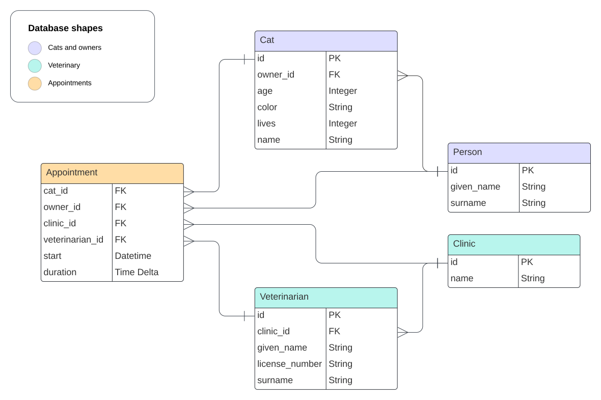

# Data Structures & Algorithms

An example of a real-world DS&A problem, commonly referred to as [N+1 Queries](https://docs.sentry.io/product/issues/issue-details/performance-issues/n-one-queries/).

@bryant-finney has encountered this problem several times in his career, and this example demonstrates how to recognize it in production.

## Background

A team of developers has built a web application that cat owners use to...

1. browse veterinarians at participating clinics
2. schedule and track their cats' veterinary appointments with their preferred provider

The application is built using a Python web framework, and the team is using an ORM to interact with the database. This repo emulates a portion of the application, defining the database models and a connection protocol for reading from the database.

## Problem

The team has recently launched a new _Success Stories_ page, which advertizes veterinary success stories from different clinics and pet owners. We tested the page extensively in a QA environment, and we used an A/B testing strategy to verify things worked well in production (for a small subset of users).

However, we were shocked to discover one morning that the production environment was down. All servers were had plateaued at 25% CPU utilization, and the application was completely unresponsive. Then we connected to the database, and we saw it was executing thousands of SQL queries every minute.

From here, we connected to a server hosting the application and concluded the issue was caused by the [N+1 Queries](https://docs.sentry.io/product/issues/issue-details/performance-issues/n-one-queries/) problem.

See if you can spot it here in the code! Then, discuss ways we could fix it.

### Data Structures

The data structures used in this problem are located in [src/models.py](src/models.py). These structures model the data stored in the database (called an ORM, or object-relational mapping). The database schema is shown below:



### Algorithms

[src/db.py](src/db.py) contains the code for connecting to the database and selecting data from it. In order to populate content in the new _Success Stories_ page, we needed write an algorithm to select all cats that had been treated at a given clinic (so that the front end to display the cats' success stories). We implemented this algorithm in the [db.Connection.get_cats_seen_at()](src/db.py#L53):

```python
def get_cats_seen_at(self, clinic_name: str) -> list[models.Cat]:
    """Return all cats seen at the given clinic."""
    clinic = self.get_clinic(clinic_name)
    veterinarians = self.get_veterinarians(clinic)
    all_appointments = [
        appointment
        for veterinarian in veterinarians
        for appointment in self.get_appointments(veterinarian)
    ]
    all_cats: list[models.Cat] = []
    for appointment in all_appointments:
        cat = self.get_cat(appointment.cat_id)
        if cat not in all_cats:
            all_cats.append(cat)
    return all_cats
```

Furthermore, we tested to make sure everything works in the [notebooks/testing.ipynb](notebooks/testing.ipynb) notebook.

## Project Setup

This project requires the following system dependencies. Follow each link to open the installation pages:

- [git-lfs](https://git-lfs.com/): used for storing the large datasets in [data/](data/)
  - After installing `git-lfs`, run `git lfs install` to initialize it
- [Python 3.8+](https://www.python.org/downloads/)
- [Poetry](https://python-poetry.org/docs/#installation)
  - There are multiple ways to install it; using [pipx](https://github.com/pypa/pipx) works well
  - To install `pipx`:
    ```sh
    # the following assumes python3 is installed on your system
    python3 -m pip install --user pipx &&
       python3 -m pipx ensurepath
    ```
  - And then to install `poetry`:
    ```sh
    pipx install poetry
    ```

With `poetry` installed, you can now clone the project and install its dependencies:

```sh
git clone https://github.com/bryant-finney/python-dsa.git &&
   cd python-dsa

# install dependencies to a virtual environment
poetry install

# to activate the virtual environment, run...
poetry shell
```
